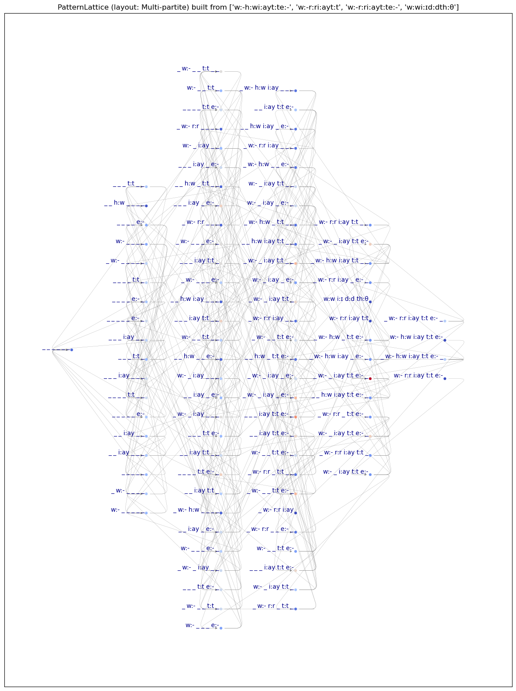

# pyPLB - Python-based (Generalized) Pattern Lattice Builder

A Python implementation of generalized Pattern Lattice Builder (gPLB) for constructing and analyzing pattern lattices from structured data.

## Overview

pyPLB builds pattern lattices - hierarchical networks that represent relationships between patterns and their generalizations. It supports both standard and **generalized** pattern lattices, offering more comprehensive analysis than traditional implementations.

Now, the default behavior of the script is not drawing a lattice in a window but saving a .png file (e.g., `g1PL.png`) in the current directory. You can change this using "-D" option, i.e., "draw instead of save" option.

### What is a Generalized Pattern Lattice?

A **standard** Pattern Lattice (at generality level 0) from input `[a, b, c]` creates an is-a network over 8 nodes:
```
{[_, _, _],
 [a, _, _], [_, b, _], [_, _, c],
 [a, b, _], [a, _, c], [_, b, c],
 [a, b, c]}
```

A **generalized** Pattern Lattice from the same input. For example, Pattern Lattice at generality level 2 creates a network over 31 nodes by also considering edge gaps and internal gaps:
```
{[_, _, _],
 [a, _, _], [_, b, _], [_, _, c],
 [a, b, _], [a, _, c], [_, b, c],
 [a, b, c],
 [_, _, _, _],
 [_, a, _, _], [_, _, b, _], [_, _, _, c],
 [_, a, b, _], [_, a, _, c], [_, _, b, c],
 [_, a, b, c],
 ... and more variants with additional gaps}
```

This generalization enables more detailed pattern analysis and is a key differentiator from [RubyPLB](https://github.com/yohasebe/rubyplb).

Detailed account of generalization will be preseted below as a separate section.

## Key Features

- ✅ **Generalized Pattern Lattices**: Three levels of generalization (0, 1, 2, 3)
- ✅ **Content Tracking**: Inspect and track variable contents throughout the lattice
- ✅ **Statistical Analysis**: Z-score calculation (normal and robust) for node importance
- ✅ **Flexible Visualization**: Multiple graph layouts via NetworkX
- ✅ **Node Pruning**: Filter lattices by z-score thresholds to manage complexity
- ✅ **Multiprocessing Support**: Efficient processing of large datasets
- ✅ **Comprehensive Output**: Detailed textual analysis including instantiation links and node statistics
- ✅ **Interactive Mode**: Jupyter notebooks for experimentation and customization

## Requirements

### Python Version
- Python 3.6 or above
- **Note**: Compatibility with Python 3.12 and 3.13 is not guaranteed

### Dependencies
```bash
pip install multiprocess networkx matplotlib scipy numpy
```

Required packages:
- `multiprocess` - Parallel processing support
- `networkx` - Graph construction and analysis
- `matplotlib` - Visualization
- `scipy` - Statistical calculations
- `numpy` - Numerical operations

## Installation
```bash
# Clone the repository
git clone https://github.com/kow-k/pyPLB.git
cd pyPLB

# Install dependencies
pip install -r requirements.txt
```

## Usage

### Command Line Interface

Run pyPLB from the command line:
```bash
python -m pyPLB [OPTIONS] <input_file>
```

**Input file format**: CSV file with one pattern per line, segments separated by commas (or custom delimiter)

### Essential Options

#### Processing
- `-M, --use_mp` - Use multiprocess for speed up (default: enabled)
- `--recursion_limit_factor` - Increase recursion_limit by factor (default: 1.0)

#### Input Processing
- `-n, --sample_n [int]` - Number of instances to sample randomly
- `-m, --max_size [int]` - Maximum number of segments per instance
- `-s, --input_field_sep [str]` - Field separator (default: `,;`: `;` for major, `,` for minor)
- `-c, --input_comment_escapes [list]` - Comment escape characters (default: `#`, `%`)

#### Pattern Processing
- `-Q, --accept_truncation` - Accept truncation of '(y)' in 'x(y)z' in input (default: enabled)
- `-P, --sep2_is_suppressive` - Make ';' as main sep and suppress ',' (default: disabled)
- `-C, --uncapitalize` - Convert all tokens to lowercase
- `-H, --split_hyphenation` - Split hyphenated tokens (default: enabled)
- `-g, --gap_mark [str]` - Gap symbol (default: `_`)

#### Generalization levels
- `-G, --generality [0|1|2|3]` - Generalization level (default: 0)
  - `0`: Standard pattern lattice
  - `1`: Add edge gaps only
  - `2`: Add internal gaps
  - `3`: Full generalization with all gap combinations

#### Analysis & Filtering
- `-p, --productivity_metric [rank|gap_size]` - Metric for productivity calculation (default: `rank`)
- `-l, --zscore_lowerbound [float]` - Minimum z-score threshold for node pruning
- `-u, --zscore_upperbound [float]` - Maximum z-score threshold for node pruning
- `-Z, --use_robust_zscore` - Suppress use of robust (median-based) z-scores

#### Visualization
- `-L, --layout [str]` - Graph layout algorithm (default: `Multi_partite`)
  - `Multi_partite` or `MP` - Multi-partite layout (similar to RubyPLB)
  - `Graphviz` or `G` - Graphviz force-directed layout
  - `ARF` - Attractive-Repulsive Forces layout
  - `FR` - Fruchterman-Reingold layout
  - `KK` - Kamada-Kawai layout
  - `Sp` - Spring layout
  - `Sh` - Shell layout
  - `C` - Circular layout
  - `Spr` - Spiral layout
  - `Spc` - Spectral layout
- `-K, --MPG_key [rank|gap_size]` - Key for multi-partite graph grouping (default: `gap_size`)
- `-A, --auto_figsizing` - Enable automatic figure size adjustment
- `-F, --fig_size [width,height]` - Figure size in inches (default: `10,9`)
- `-d, --fig_dpit [int]` - Figure dpi value (default: `620`)
- `-J, --use_multibyte_chars` - Enable multibyte font support (for Japanese, etc.)
- `-x, --scaling_factor [float]` - Scaling factor for layouts (default: 5)

#### Output Control
- `-v, --verbose` - Enable verbose output
- `-w, --detailed` - Enable detailed debug output
- `-D, --save_instead_of_draw` - Disable automatic file saving and draw into window
- `-I, --draw_individual_lattices` - Draw individual lattices before merging
- `-S, --build_lattice_stepwise` - Build and display lattice incrementally
- `-i, --mark_instances` - Highlight instance nodes in the graph
- `-N, --print_link_targets` - Print link target statistics
- `-o, --print_forms` - Print pattern forms and exit (no graph)

### Usage Examples

#### Basic Usage
```bash
# Standard pattern lattice from CSV file
python -m pyPLB data.csv

# Generalized pattern lattice (level 2)
python -m pyPLB -G 2 data.csv

# Sample 50 instances with verbose output
python -m pyPLB -s 50 -v data.csv
```

#### Input Filtering
```bash
# Run in "phrasal" mode (segments by ";" only, ignoring segments by ",")
python -m pyPLB -G 2 -P data.csv
```

#### Advanced Filtering
```bash
# Filter nodes by z-score (keep nodes with z-score > -0.5)
python -m pyPLB -G 2 -l -0.5 data.csv

# Use robust z-scores with upper and lower bounds
python -m pyPLB -G 2 -Z -l -0.5 -u 2.0 data.csv

# Filter by gap_size metric instead of rank
python -m pyPLB -G 2 -p gap_size -l 0.0 data.csv
```

#### Visualization Customization
```bash
# Use Kamada-Kawai layout with auto-sizing
python -m pyPLB -G 2 -L KK -A data.csv

# Custom figure size with Graphviz layout
python -m pyPLB -L G -F 15,12 data.csv

# Multi-partite layout grouped by rank
python -m pyPLB -L MP -k rank data.csv
```

#### Processing Options


```bash
# Process with custom delimiter and no capitalization
python -m pyPLB -s ";" -C data.csv

# Process with disabling segmenation with ","
python -m pyPLB -P data.csv

# Keep hyphenated tokens together, remove punctuation
python -m pyPLB -H -P data.csv

# Process only short patterns (max 5 segments)
python -m pyPLB -m 5 data.csv
```

### Input File Format

Create a CSV file with one pattern per line:
```csv
# Comments starting with # or % are ignored
a,big,boy
the,big,boy
a,big,girl
the,big,girl
a,funny,boy
the,funny,boy
```

Or use custom delimiters:
```
a big boy
the big boy
a big girl
```

Run with: `python -m pyPLB -s " " input.txt`

## Interactive Usage with Jupyter Notebooks

### pyPLB-runner.ipynb

[pyPLB-runner.ipynb](pyPLB-runner.ipynb) provides an interactive environment for:
- Experimenting with different parameters
- Fine-tuning visualizations
- Customizing graph layouts and styling
- Iterative analysis and exploration

**Recommended for**: Complex visualizations requiring manual adjustments

### pyPLB-runner-on-bare-items.ipynb

[pyPLB-runner-on-bare-items.ipynb](pyPLB-runner-on-bare-items.ipynb) accepts unsegmented text:
- Processes raw words or sentences
- Supports regex-based item selection
- Incremental lattice building (better memory efficiency)
- Handles larger datasets without memory errors

**Example**: Process sentences by setting field separator to `r"[,;:]?\s*"`

## Sample Output

### Text Output
```
##Parameters
#generality: 2
#p_metric [productivity metric]: gap_size
#use_robust_zscore: True

##Source lists:
#source 0: ['a', 'big', 'boy']
#source 1: ['the', 'big', 'boy']
...

##Generating g2PLs ...
#generating g2PL 1 from Pattern ([('a', ['a']), ('big', ['big']), ('boy', ['boy'])])

##Results
#Merger has 127 nodes
#Merger has 245 links
#node ('a', 'big', 'boy') has z-score  1.234 (n: 15)
...
```

### Visual Output



*Example: Generalized Pattern Lattice from [XiY-wiper3-dual](sources/plb-XiY-wiper3-dual.csv) with z-score pruning (threshold: 0.0)*


## Architecture

### Package Structure
```
pyPLB/
├── __init__.py          # Package initialization
├── __main__.py          # CLI entry point
├── pattern.py           # Pattern class and operations
├── pattern_link.py      # Pattern link relationships
├── pattern_lattice.py   # Lattice construction and analysis
└── utils.py             # Utility functions
```

### Key Classes

- **Pattern**: Represents a single pattern with form and content
- **PatternLink**: Represents instantiation relationships between patterns
- **PatternLattice**: Manages the complete lattice structure and operations

## Theory and Background

Pattern Lattices provide a formal framework for representing and analyzing linguistic patterns and their relationships. The is-a (instantiation) links connect more specific patterns to their generalizations.

**Further Reading**:
- [Pattern Lattice as a model for linguistic knowledge and performance](https://aclanthology.org/Y09-1030.pdf) (Kuroda & Hasebe, 2009)

## Performance Considerations

- **Multiprocessing**: Enabled by default for link generation (disable with inspection parameters if needed)
- **Memory Usage**: Generalization level 2+ can create large lattices; use z-score pruning for big datasets
- **Incremental Building**: Use stepwise mode (`-S`) for very large inputs

## Troubleshooting

### Common Issues

**ImportError: attempted relative import with no known parent package**
- Solution: Run as module: `python -m pyPLB` instead of `python __main__.py`

**Memory Error with large datasets**
- Solution 1: Use z-score pruning (`-zl`, `-zu`)
- Solution 2: Reduce sample size (`-s`)
- Solution 3: Limit pattern length (`-m`)
- Solution 4: Use stepwise building (`-S`)

**Graph too cluttered**
- Solution 1: Apply z-score filtering
- Solution 2: Try different layouts (`-L`)
- Solution 3: Enable auto-sizing (`-A`)

## Understanding Generalization Levels

pyPLB supports four levels of generalization (0, 1, 2, 3), each creating progressively more comprehensive pattern lattices. The generalization level determines how gaps (wildcards represented as `_`) are inserted into patterns.

### Level 0: Standard Pattern Lattice (No Generalization)

**Usage**: `-G 0` (default)

The standard pattern lattice only considers the original pattern and its direct sub-patterns by replacing individual elements with gaps.

**Example**: Input `[a, b, c]` generates 8 nodes:
```
Level (Rank 0):  [_, _, _]                    # Fully gapped (most general)

Level (Rank 1):  [a, _, _]  [_, b, _]  [_, _, c]

Level (Rank 2):  [a, b, _]  [a, _, c]  [_, b, c]

Level (Rank 3):  [a, b, c]                    # Original pattern (most specific)
```

**Total nodes**: 2³ = 8 nodes

**Use case**: Basic pattern analysis, smaller datasets, when you only need direct generalizations

---

### Level 1: Edge Gaps Only

**Usage**: `-G 1`

Adds gaps at the **beginning and/or end** of patterns, allowing for prefix and suffix variations. This captures patterns where elements may appear in different positions at the edges.

**Example**: Input `[a, b, c]` generates the 8 standard nodes PLUS:
```
Edge gaps (length 4):
[_, a, b, c]        # Gap at beginning
[a, b, c, _]        # Gap at end
[_, a, b, c, _]     # Gaps at both edges

Edge gaps (length 3):
[_, a, b]  [_, a, c]  [_, b, c]  [a, b, _]  [a, c, _]  [b, c, _]

Edge gaps (length 2):
[_, a]  [_, b]  [_, c]  [a, _]  [b, _]  [c, _]

Edge gaps (length 1):
[_]
```

**Total nodes**: 8 (standard) + additional edge-gapped variants ≈ 15-20 nodes (depends on pattern)

**Use case**:
- Analyzing word boundaries (prefixes/suffixes in linguistics)
- Patterns where position at edges matters
- Moderate increase in lattice complexity

**Visual representation**:
```
Original:     [a, b, c]
Edge left:    [_, a, b, c]      # Something before 'a'
Edge right:   [a, b, c, _]      # Something after 'c'
Edge both:    [_, a, b, c, _]   # Something before and after
```

---

### Level 2: Internal Gaps

**Usage**: `-G 2`

Adds gaps **between elements** (internal positions), but NOT at the edges. This captures patterns with optional internal elements or flexible word order.

**Example**: Input `[a, b, c]` generates standard nodes PLUS:
```
Internal gaps (between elements):
[a, _, b, c]        # Gap between 'a' and 'b'
[a, b, _, c]        # Gap between 'b' and 'c'
[a, _, b, _, c]     # Gaps at both internal positions

With further gapping:
[a, _, _, c]        # 'b' gapped out, internal gap remains
[a, _, b, _]        # 'c' gapped out, internal gap remains
...and many more combinations
```

**Total nodes**: 8 (standard) + 15-30 internal variants ≈ 23-38 nodes

**Use case**:
- Analyzing word order flexibility
- Optional elements within patterns (e.g., adjectives in noun phrases)
- Non-contiguous patterns (A...B where something can appear between)
- Medium-to-large lattice complexity

**Visual representation**:
```
Original:     [a, b, c]
Internal 1:   [a, _, b, c]      # Something between 'a' and 'b'
Internal 2:   [a, b, _, c]      # Something between 'b' and 'c'
Both:         [a, _, b, _, c]   # Multiple internal gaps
```

---

### Level 3: Full Generalization (Edge + Internal Gaps)

**Usage**: `-G 3`

Combines **both edge gaps (Level 1) AND internal gaps (Level 2)**, creating the most comprehensive lattice with all possible gap positions.

**Example**: Input `[a, b, c]` generates:
```
Standard (8 nodes):
[_, _, _]
[a, _, _]  [_, b, _]  [_, _, c]
[a, b, _]  [a, _, c]  [_, b, c]
[a, b, c]

Edge gaps only (from Level 1):
[_, a, b, c]
[a, b, c, _]
[_, a, b, c, _]
...and all edge-gapped sub-patterns

Internal gaps only (from Level 2):
[a, _, b, c]
[a, b, _, c]
[a, _, b, _, c]
...and all internally-gapped sub-patterns

Combined (edge + internal):
[_, a, _, b, c]          # Left edge + internal gap
[a, _, b, c, _]          # Internal gap + right edge
[_, a, _, b, c, _]       # Both edges + internal gap
[_, a, b, _, c]          # Left edge + different internal gap
[a, b, _, c, _]          # Different internal + right edge
[_, a, b, _, c, _]       # Both edges + different internal
[_, a, _, b, _, c]       # Left edge + both internals
[a, _, b, _, c, _]       # Both internals + right edge
[_, a, _, b, _, c, _]    # All gaps: edges + internals
...and many more combinations
```

**Total nodes**: 8 (standard) + Level 1 variants + Level 2 variants + combined variants ≈ **50-100+ nodes** for a 3-element pattern

**Use case**:
- Comprehensive linguistic analysis
- Maximum pattern flexibility
- Research requiring exhaustive pattern coverage
- **Warning**: Creates very large lattices; use z-score pruning!

**Visual representation**:
```
Original:          [a, b, c]
Full example:      [_, a, _, b, _, c, _]
                    ^   ^   ^   ^   ^
                    |   |   |   |   └─ Right edge gap
                    |   |   |   └───── Internal gap 2
                    |   |   └───────── Between b and c
                    |   └───────────── Internal gap 1
                    └───────────────── Left edge gap
```

---

## Generalization Level Comparison Table

| Level | Description | Gap Positions | Approx. Nodes* | Complexity | Best For |
|-------|-------------|---------------|----------------|------------|----------|
| **0** | Standard | Element substitution only | 2ⁿ | Low | Basic analysis, small datasets |
| **1** | Edge gaps | Beginning and/or end | 2ⁿ + ~10-20 | Medium | Prefix/suffix patterns, boundaries |
| **2** | Internal gaps | Between elements | 2ⁿ + ~15-30 | Medium-High | Word order, optional elements |
| **3** | Full | All positions (edge + internal) | 2ⁿ + ~40-100+ | Very High | Comprehensive analysis, research |

*For a 3-element pattern; scales exponentially with pattern length

---

## Choosing the Right Generalization Level

### Use Level 0 when:
- ✅ You have limited computational resources
- ✅ You want quick, basic pattern analysis
- ✅ Your patterns are simple and short
- ✅ You don't need positional flexibility

### Use Level 1 when:
- ✅ Analyzing prefixes or suffixes (linguistic morphology)
- ✅ Patterns where edge position matters (e.g., "the X", "X-ing")
- ✅ You need moderate generalization without too much complexity
- ✅ Studying boundary phenomena

### Use Level 2 when:
- ✅ Analyzing word order variations (e.g., "big red car" vs "red big car")
- ✅ Optional elements appear within patterns (e.g., "very big car")
- ✅ Non-contiguous patterns are important
- ✅ You want to capture internal flexibility

### Use Level 3 when:
- ✅ You need comprehensive, exhaustive analysis
- ✅ Computational resources are adequate
- ✅ You're conducting linguistic research
- ✅ You can use z-score pruning to manage complexity
- ⚠️ **Important**: Always use `-zl` (z-score lower bound) to prune low-importance nodes!

---

## Practical Examples

### Example 1: Phrasal Patterns (Level 1)

**Input**: `["a", "big", "boy"]`

**Level 0 output** (8 nodes):
```
[_, _, _]
[a, _, _], [_, big, _], [_, _, boy]
[a, big, _], [a, _, boy], [_, big, boy]
[a, big, boy]
```

**Level 1 output** (adds ~10 nodes):
```
...plus:
[_, a, big, boy]           # "the a big boy" - determiner slot
[a, big, boy, _]           # "a big boy runs" - verb slot
[_, a, big, boy, _]        # Both slots
```

### Example 2: Word Order (Level 2)

**Input**: `["red", "big", "car"]`

**Level 2 captures**:
```
[red, big, car]            # Original: "red big car"
[red, _, big, car]         # "red very big car" - internal element
[red, big, _, car]         # "red big old car" - internal element
[red, _, big, _, car]      # "red very big old car" - multiple internals
```

### Example 3: Maximum Flexibility (Level 3)

**Input**: `["the", "cat", "sat"]`

**Level 3 captures everything**:
```
[the, cat, sat]                    # Original
[_, the, cat, sat]                 # "Maybe the cat sat"
[the, _, cat, sat]                 # "the black cat sat"
[the, cat, _, sat]                 # "the cat quickly sat"
[the, cat, sat, _]                 # "the cat sat down"
[_, the, _, cat, sat]              # Multiple variations
[_, the, cat, _, sat, _]           # Even more flexibility
...and many more combinations
```

---

## Performance and Memory Considerations

### Node Count Growth

For a pattern of length `n`:

| Length | Level 0 | Level 1 (approx) | Level 2 (approx) | Level 3 (approx) |
|--------|---------|------------------|------------------|------------------|
| 2 | 4 | ~8 | ~10 | ~15 |
| 3 | 8 | ~18 | ~25 | ~50 |
| 4 | 16 | ~35 | ~60 | ~150 |
| 5 | 32 | ~70 | ~140 | ~400+ |

### Memory Management Tips

For Level 2-3 with large datasets:
```bash
# Always use z-score pruning
python -m pyPLB -G 3 -zl -0.5 -zu 2.0 data.csv

# Limit pattern length
python -m pyPLB -G 3 -m 4 -zl 0.0 data.csv

# Sample your data
python -m pyPLB -G 3 -s 50 -zl 0.0 data.csv

# Use stepwise building for incremental display
python -m pyPLB -G 3 -S -zl 0.0 data.csv
```

---

## Summary

- **Level 0**: Basic pattern lattice (fastest, simplest)
- **Level 1**: + Edge gaps (prefixes/suffixes)
- **Level 2**: + Internal gaps (word order flexibility)
- **Level 3**: + Everything (most comprehensive, use with caution!)

**Rule of thumb**: Start with Level 0 or 1, then increase if you need more detail. Always use z-score pruning (`-zl`) with Level 2-3!

## Contributing

Contributions are welcome! Please feel free to submit issues or pull requests.

## License

MIT License

## Citation

If you use pyPLB in your research, please cite:
```bibtex
@misc{pyPLB,
  author = {Kow Kuroda},
  title = {pyPLB: Python-based (Generalized) Pattern Lattice Builder},
  year = {2024-2025},
  publisher = {GitHub},
  url = {https://github.com/kow-k/pyPLB}
}
```

## Acknowledgments

This project builds upon the concepts from RubyPLB, developed by Yoichiro Hasebe and Kow Kuroda.

## Contact

[kow.kuroda@gmail.com]
